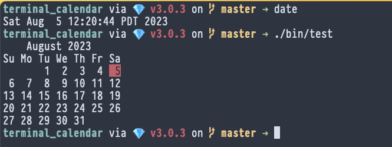

# TerminalCalendar

> A ruby calendar and day picker for the terminal

## Installation

Install the gem and add to the application's Gemfile by executing:

    $ bundle add terminal_calendar

If bundler is not being used to manage dependencies, install the gem by executing:

    $ gem install terminal_calendar

## Usage

`terminal_calendar` can be used to render a calendar page similar to the linux tool `cal`:

```ruby
require 'terminal_calendar'
# this will render a calendar for the current month to the comma(nd line
puts TerminalCalendar.cal
```

 

`terminal_calendar` can also be used as a date picker to select days from a calendar:


In the above GIF, the following code allows dates to be picked:

```ruby
require 'terminal_calendar'

dates = TerminalCalendar.date_picker

# where dates is an Array of Date objects
```

When the calendar pops up the cursor is navigated with standard error keys, `Tab` toggles a day as selected, and `Enter` will end the picking session

## Development

After checking out the repo, run `bin/setup` to install dependencies. Then, run `rake spec` to run the tests. You can also run `bin/console` for an interactive prompt that will allow you to experiment.

To install this gem onto your local machine, run `bundle exec rake install`. To release a new version, update the version number in `version.rb`, and then run `bundle exec rake release`, which will create a git tag for the version, push git commits and the created tag, and push the `.gem` file to [rubygems.org](https://rubygems.org).

## Contributing

Bug reports and pull requests are welcome on GitHub at https://github.com/mcordell/terminal_calendar.

## License

The gem is available as open source under the terms of the [MIT License](https://opensource.org/license/mit/).

## Copyright

Copyright (c) 2023 Michael Cordell. See LICENSE for further details.
